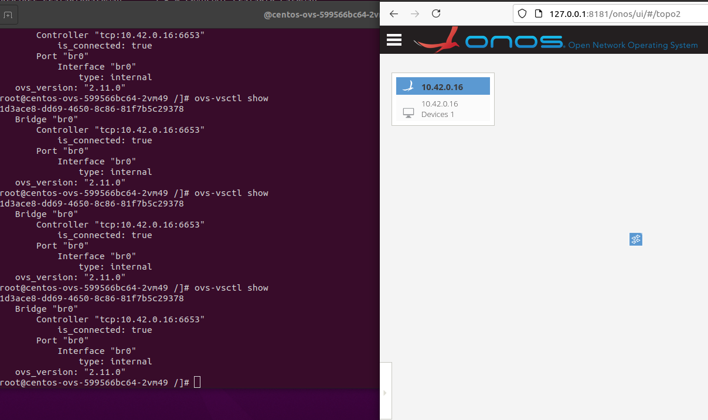

# 使用k3s创建分布式SDN集群
## 0. Get start
- 单节点（本地部署server）
```bash
2.1 -> 2.2 (可以不用部署dashoboard) -> 5.1
```
- 多节点（加入已有集群）
```bash
2.1 -> 2.3 -> 2.4 -> 5.1
```
## 1. 介绍
k3s是k8s（kubenertes）的简化版，功能和k8s几乎一致，使用k3s创建集群可以进一步节省硬件资源。

与openstack架构类似，k3s/k8s同样分为控制节点和计算节点两种类型。其中控制节点被称为server节点，计算节点被称为agent节点。计算节点加入k3s集群后实现分布式资源的整合和统一管理。
server节点负责集群网络的维护、节点管理、镜像服务、loadbalancer服务、认证服务。
agent节点负责提供计算、存储、网络资源。

可以使用k3s创建ubuntu/centos容器，等效于openstack使用KVM创建虚拟机实例。

## 2. 环境配置
### 2.1 环境准备
server节点/agent节点：
1. ubuntu/centos虚拟机（内存>=2G）
2. 网络：server节点需要与agent节点处于同一个vlan
### 2.2 server节点部署
1. docker安装
```bash
sudo apt-get install docker.io
```
2. k3s安装
```bash
curl -sfL http://rancher-mirror.cnrancher.com/k3s/k3s-install.sh | INSTALL_K3S_MIRROR=cn sh -
```
3. dashboard安装(option)
- 获取配置文件
```bash
sudo su #切换到root用户（需要在root用户下才能对k3s、docker进行操作）
GITHUB_URL=https://github.com/kubernetes/dashboard/releases
VERSION_KUBE_DASHBOARD=$(curl -w '%{url_effective}' -I -L -s -S ${GITHUB_URL}/latest -o /dev/null | sed -e 's|.*/||')
kubectl create -f https://raw.githubusercontent.com/kubernetes/dashboard/${VERSION_KUBE_DASHBOARD}/aio/deploy/recommended.yaml
```
- 创建用户配置文件
```bash
#新建dashboard.admin-user.yml和dashboard.admin-user-role.yml两个yaml文件
vim dashboard.admin-user.yml
--------------------------------------------------------------------------------------------------------
# dashboard.admin-user.yml:
apiVersion: v1
kind: ServiceAccount
metadata:
  name: admin-user
  namespace: kubernetes-dashboard
--------------------------------------------------------------------------------------------------------
```
```bash
vim dashboard.admin-user-role.yml
--------------------------------------------------------------------------------------------------------
# dashboard.admin-user.yml:
apiVersion: rbac.authorization.k8s.io/v1
kind: ClusterRoleBinding
metadata:
  name: admin-user
roleRef:
  apiGroup: rbac.authorization.k8s.io
  kind: ClusterRole
  name: cluster-admin
subjects:
  - kind: ServiceAccount
    name: admin-user
    namespace: kubernetes-dashboard
----------------------------------------------------------------------------------------------------------
```
- 创建用户
```bash
kubectl create -f dashboard.admin-user.yml -f dashboard.admin-user-role.yml #在k3s中部署刚刚创建的两个yaml文件
```
- 查看dashboard镜像部署情况
```bash
kubectl get pods --all-namespaces
#出现以下提示则说明镜像部署成功：
kubernetes-dashboard   dashboard-metrics-scraper-856586f554-dmqtt   1/1     Running     0          53m
kubernetes-dashboard   kubernetes-dashboard-67484c44f6-nrlzl        1/1     Running     0          53m
```

- 获取toke
```bash
k3s kubectl -n kubernetes-dashboard describe secret admin-user-token | grep '^token'
#结果如:      eyJhbGciOiJSUzI1NiIsImtpZCI6Il9PODcyS2w0V2tQd2pvODQ0Vy0tZkZTYlI0VU95cVZ4MDNmNVo0ZmpISkEifQ.eyJpc3MiOiJrdWJlcm5ldGVzL3NlcnZpY2VhY2NvdW50Iiwia3ViZXJuZXRlcy5pby9zZXJ2aWNlYWNjb3VudC9uYW1lc3BhY2UiOiJrdWJlcm5ldGVzLWRhc2hib2FyZCIsImt1YmVybmV0ZXMuaW8vc2VydmljZWFjY291bnQvc2VjcmV0Lm5hbWUiOiJhZG1pbi11c2VyLXRva2VuLW1na3ZiIiwia3ViZXJuZXRlcy5pby9zZXJ2aWNlYWNjb3VudC9zZXJ2aWNlLWFjY291bnQubmFtZSI6ImFkbWluLXVzZXIiLCJrdWJlcm5ldGVzLmlvL3NlcnZpY2VhY2NvdW50L3NlcnZpY2UtYWNjb3VudC51aWQiOiI0YzJhNDAwZi03MjMzLTQzYzUtODJmNC02MWU2ZTU0ZjNjMmUiLCJzdWIiOiJzeXN0ZW06c2VydmljZWFjY291bnQ6a3ViZXJuZXRlcy1kYXNoYm9hcmQ6YWRtaW4tdXNlciJ9.1K46klBrqha8VPlQckUh0kTa2KSNYJFFRU48VpozwsasLLp7eL3wClEu04MG3oAlOi2d2-dRnSXrPoan4XJ1oZtolAyVWTTvyOOJIu8mJ9sQnnsCkC2KtrVVGmdgmJZT7alY6IuunUII0YCJmhW80IhUJjxzaxYzCJ9WrL9SCYtFne4ombb9irBdWvCrYwsO6atWrNGUHuTlZhoZiwztBvepga0TcYxJv3bXAa-KL-2Ty2DDwhOwXOG2h78xuPQMWIW2dga6ZX7bBgovUMUPoyCpMpE4kxKYB5_aPAp7dmNuZ1_IabB8Pk9zMHsR_iBXaNZOagWqpKeyJ66OOZgwLw
```
- 开启dashboard http代理
```bash
k3s kubectl proxy
```
- 登陆dashboard
```bash
http://localhost:8001/api/v1/namespaces/kubernetes-dashboard/services/https:kubernetes-dashboard:/proxy/
#使用admin-user Bearer Token Sign In
```

### 2.3 agent节点部署

docker安装步骤和server节点一样

- 获取server节点token
```bash
#在server节点进入root用户
cat /var/lib/rancher/k3s/server/node-token

#结果如：K1068b8ef2427b101299bd1d833ed179bca1def98f5d76e79bfe6911efcb0627046::server:dd980aa2a0c50809a39f8093094abcb3
```
- 部署k3s并加入集群
```bash
curl -sfL http://rancher-mirror.cnrancher.com/k3s/k3s-install.sh | INSTALL_K3S_MIRROR=cn K3S_URL=https://myserver:6443 K3S_TOKEN=mynodetoken sh -

#需要将https://myserver:6443 替换为server地址，K3S_TOKEN替换为上一步获得的token
```
- kubectl
```bash
#angent节点使用kubectl命令需要加k3s
k3s kubectl get pods

#或者可以使用alias命令重链接kucectl命令
alias kubectl='k3s kubectl'
```
### 2.4 在agent节点设置kubeconfig配置文件
```bash
#在server节点root用户下
cat /etc/rancher/k3s/k3s.yaml
结果如：
------------------------------------------------------------------------
apiVersion: v1
clusters:
- cluster:
    certificate-authority-data: LS0tLS1CRUdJTiBDRVJUSUZJQ0FURS0tLS0tCk1JSUJkakNDQVIyZ0F3SUJBZ0lCQURBS0JnZ3Foa2pPUFFRREFqQWpNU0V3SHdZRFZRUUREQmhyTTNNdGMyVnkKZG1WeUxXTmhRREUyTWpRMU1UVXlNemN3SGhjTk1qRXdOakkwTURZeE16VTNXaGNOTXpFd05qSXlNRFl4TXpVMwpXakFqTVNFd0h3WURWUVFEREJock0zTXRjMlZ5ZG1WeUxXTmhRREUyTWpRMU1UVXlNemN3V1RBVEJnY3Foa2pPClBRSUJCZ2dxaGtqT1BRTUJCd05DQUFUTVVpYTJRNUlzeGJtZGRTUk1CazZOSnNMeU44VWhUdWhkK1FkSHFBNjQKcU9LT3RvMEcvMk9LUWs2ZEFyNWpXRFRGRGU4c2MzL1FxZUZ6YVNDYkEwMVRvMEl3UURBT0JnTlZIUThCQWY4RQpCQU1DQXFRd0R3WURWUjBUQVFIL0JBVXdBd0VCL3pBZEJnTlZIUTRFRmdRVXZxOUN2NkxBcXV6VmV4UHNaSTkrClJSZmhDR2N3Q2dZSUtvWkl6ajBFQXdJRFJ3QXdSQUlnVEVTYW01TTJjS1o2YU0wVHk0R1dMeUFpTGNWdzZZemQKM0QvNVo3V0JhWU1DSUQ5UkIvbGh3QVZGWEhhdnJVRWpTdVk1dk40UGdEMXJERGpKZXFBTVY5ZHIKLS0tLS1FTkQgQ0VSVElGSUNBVEUtLS0tLQo=
    server: https://127.0.0.1:6443
  name: default
contexts:
- context:
    cluster: default
    user: default
  name: default
current-context: default
kind: Config
preferences: {}
users:
- name: default
  user:
    client-certificate-data: LS0tLS1CRUdJTiBDRVJUSUZJQ0FURS0tLS0tCk1JSUJrVENDQVRlZ0F3SUJBZ0lJTW1rZkRpYjN5dGt3Q2dZSUtvWkl6ajBFQXdJd0l6RWhNQjhHQTFVRUF3d1kKYXpOekxXTnNhV1Z1ZEMxallVQXhOakkwTlRFMU1qTTNNQjRYRFRJeE1EWXlOREEyTVRNMU4xb1hEVEl5TURZeQpOREEyTVRNMU4xb3dNREVYTUJVR0ExVUVDaE1PYzNsemRHVnRPbTFoYzNSbGNuTXhGVEFUQmdOVkJBTVRESE41CmMzUmxiVHBoWkcxcGJqQlpNQk1HQnlxR1NNNDlBZ0VHQ0NxR1NNNDlBd0VIQTBJQUJIZ1ZWS0VYS1pmaklTT2kKYkFlWHJBTlZSMEpFTjFYVFlpZFNRVDcxL1NHRjdWYVU2RFFERzYyR3RQMzhYa0d6cCtTbVBBdFZNQ3Nhc3I5KwpWUUJhcDUyalNEQkdNQTRHQTFVZER3RUIvd1FFQXdJRm9EQVRCZ05WSFNVRUREQUtCZ2dyQmdFRkJRY0RBakFmCkJnTlZIU01FR0RBV2dCU2k4UW0vSGpQTEF6TlFCckNRaFNpMGdnNnZjakFLQmdncWhrak9QUVFEQWdOSUFEQkYKQWlFQTV6V25UdkF3L2lzQWtmK08yS3pUK1FkNDRlbzhrekR0eE5SVjd5TUhNaDBDSUcreWVEb2hEaEFxTU5iUwp5Q0xaaWZETDlPUlloT1YrT3dnc0k3UkdtSFJNCi0tLS0tRU5EIENFUlRJRklDQVRFLS0tLS0KLS0tLS1CRUdJTiBDRVJUSUZJQ0FURS0tLS0tCk1JSUJkekNDQVIyZ0F3SUJBZ0lCQURBS0JnZ3Foa2pPUFFRREFqQWpNU0V3SHdZRFZRUUREQmhyTTNNdFkyeHAKWlc1MExXTmhRREUyTWpRMU1UVXlNemN3SGhjTk1qRXdOakkwTURZeE16VTNXaGNOTXpFd05qSXlNRFl4TXpVMwpXakFqTVNFd0h3WURWUVFEREJock0zTXRZMnhwWlc1MExXTmhRREUyTWpRMU1UVXlNemN3V1RBVEJnY3Foa2pPClBRSUJCZ2dxaGtqT1BRTUJCd05DQUFRMnI1TEhSOTZPbnc4b0pXWSszZGdpZFVoeFVWbkdiOVozN3V1eDd6QWMKUWlQWUt2OWJXWEtDQ2M3REFHR0gyKzQ5dStaUHZxY1JkZFdiUkViUUVXTjdvMEl3UURBT0JnTlZIUThCQWY4RQpCQU1DQXFRd0R3WURWUjBUQVFIL0JBVXdBd0VCL3pBZEJnTlZIUTRFRmdRVW92RUp2eDR6eXdNelVBYXdrSVVvCnRJSU9yM0l3Q2dZSUtvWkl6ajBFQXdJRFNBQXdSUUloQUpmaG5BNEZVSkpWK1cxeVEyYU1FbmlaMGtsc3VjQkQKMkNuYStnVm80aXFPQWlCdFRSNldSUE1DNnZEeXhmbGRHS3c2Tk5id1VvbHhFOFNYcUdjclAwTkEyQT09Ci0tLS0tRU5EIENFUlRJRklDQVRFLS0tLS0K
    client-key-data: LS0tLS1CRUdJTiBFQyBQUklWQVRFIEtFWS0tLS0tCk1IY0NBUUVFSUF0R3FhdnJGWVBjNXdHT3NiZWN1UjhleGExNEFJT29odE9WaXVmbElKVWVvQW9HQ0NxR1NNNDkKQXdFSG9VUURRZ0FFZUJWVW9SY3BsK01oSTZKc0I1ZXNBMVZIUWtRM1ZkTmlKMUpCUHZYOUlZWHRWcFRvTkFNYgpyWWEwL2Z4ZVFiT241S1k4QzFVd0t4cXl2MzVWQUZxbm5RPT0KLS0tLS1FTkQgRUMgUFJJVkFURSBLRVktLS0tLQo=
------------------------------------------------------------------------
```
```bash
#在agent节点root用户下
cd /etc/rancher
mkdir k3s
vim k3s.yaml #粘贴server节点中k3s.yaml内容，并将其中ip换成server节点ip
```
```bash
kubectl get nodes #能够正确显示节点 则说明kubeconfig配置成功
```

## 3. kubectl基本操作
k8s/k3s 一般都使用kubectl命令管理集群
kubectl命令语句结构一般是：kubectl + 操作方法（get、create、edit、delete、exec、describe）+ 资源类型（pods、nodes、deployment、ingress、service）+ 资源名称

### 3.1 查看节点个数(nodes)
```bash
kubectl get nodes  #查看本地节点
结果如：
root@ubuntu:/home/test# kubectl get nodes
NAME             STATUS   ROLES                  AGE   VERSION
zzh-virtualbox   Ready    <none>                 16h   v1.21.1+k3s1
ubuntu           Ready    control-plane,master   16h   v1.21.1+k3s1
node1            Ready    <none>                 16h   v1.21.1+k3s1


kubectl get nodes -o wide #加入 -o 操作符 可以看到更多资源信息
结果如：
root@ubuntu:/home/test# kubectl get nodes -o wide
NAME             STATUS   ROLES                  AGE   VERSION        INTERNAL-IP     EXTERNAL-IP   OS-IMAGE             KERNEL-VERSION     CONTAINER-RUNTIME
zzh-virtualbox   Ready    <none>                 16h   v1.21.1+k3s1   10.128.230.80   <none>        Ubuntu 20.04.2 LTS   5.8.0-55-generic   containerd://1.4.4-k3s2
ubuntu           Ready    control-plane,master   16h   v1.21.1+k3s1   10.128.244.14   <none>        Ubuntu 20.04.2 LTS   5.8.0-55-generic   containerd://1.4.4-k3s2
node1            Ready    <none>                 16h   v1.21.1+k3s1   10.128.240.5    <none>        Ubuntu 20.04.2 LTS   5.8.0-55-generic   containerd://1.4.4-k3s2
```
### 3.2 部署一个服务
```bash
#k8s/k3s部署具有功能的pods有两种方式：1.使用deployment部署；2.使用run命令部署。
#deployment部署：pods运行故障时，k3s会调用新的资源创建功能相同的pods以保障服务不间断
#run命令部署：pods运行故障时，k3s不做任何处理，适用于测试。

#deployment部署的基本操作：
kubectl create deployment centos-test --image=centos
结果如：
root@ubuntu:/home/test# kubectl create deployment centos-test --image=centos
deployment.apps/centos-test created
root@ubuntu:/home/test# kubectl get deployment
NAME          READY   UP-TO-DATE   AVAILABLE   AGE
ubuntu-0      1/1     1            1           16h
centos        1/1     1            1           37m
centos-test   0/1     1            0           13s

# 部署完deployment后，k8s/k3s会调用资源创建pods，此时可以查看pods运行状况
kubectl get pods
结果如：
root@ubuntu:/home/test# kubectl get pods
NAME                           READY   STATUS             RESTARTS   AGE
ubuntu-0-7787cb6b-774m2        1/1     Running            0          16h
centos-77db7d6499-nwpvr        1/1     Running            0          40m
centos-test-86f58697c5-cbrwh   0/1     CrashLoopBackOff   4          2m39s

#可以看到 centos-test-86f58697c5-cbrwh   0/1     CrashLoopBackOff   4          2m39s
#直接使用create命令创建deployment部署centos/ubuntu pods会出bug，解决办法是修改deployment配置文件。
kubectl edit deployment centos-test
#找到如下部分：
spec:
  progressDeadlineSeconds: 600
  replicas: 1
  revisionHistoryLimit: 10
  selector:
    matchLabels:
      app: centos-test
  strategy:
    rollingUpdate:
      maxSurge: 25%
      maxUnavailable: 25%
    type: RollingUpdate
  template:
    metadata:
      creationTimestamp: null
      labels:
        app: centos-test
    spec:
      containers:                                          # <- 找到该位置，containers标签下的内容修改为：
      - image: centos                                      #  - args:
        imagePullPolicy: Always                            #  - while true; do sleep 30; done;
        name: centos                                       #  command:
        resources: {}                                      #  - /usr/sbin/init               
        terminationMessagePath: /dev/termination-log       #  - -c
        terminationMessagePolicy: File                     #  image: centos
      dnsPolicy: ClusterFirst                              #  name: centos
      restartPolicy: Always                                #  resources: {}
      schedulerName: default-scheduler                     #  securityContext:
      securityContext: {}                                  #  privileged: true
      terminationGracePeriodSeconds: 30

#为避免这个bug，建议采用配置文件创建deployment
#首先创建一个配置文件centos.yaml,然后使用kubectl apply 命令创建deployment，具体操作如下：
#centos.yaml的内容如下：
--------------------------------------------------------------------------
apiVersion: apps/v1
kind: Deployment
metadata:
  creationTimestamp: null
  labels:
    app: centos
  name: centos
spec:
  replicas: 1
  selector:
    matchLabels:
      app: centos
  strategy: {}
  template:
    metadata:
      creationTimestamp: null
      labels:
        app: centos
    spec:
      containers:
      - args:
        - while true; do sleep 30; done;
        command:
        - /usr/sbin/init                         
        - -c
        - --                                                           
        image: centos
        name: centos
        resources: {}
        securityContext:
          privileged: true
status: {}
-------------------------------------------------------------------------------
vim centos.yaml # 复制以上内容
kubectl apply -f centos.yaml
结果如：
root@ubuntu:/home/test# ls
centos.yaml  Desktop  Documents  Downloads  k3s-config  Music  Pictures  Public  Templates  ubuntu.yaml  Videos
root@ubuntu:/home/test# kubectl apply -f centos.yaml 
deployment.apps/centos created
root@ubuntu:/home/test# kubectl get deploy
NAME       READY   UP-TO-DATE   AVAILABLE   AGE
ubuntu-0   1/1     1            1           17h
centos     1/1     1            1           9s
root@ubuntu:/home/test# kubectl get pods
NAME                      READY   STATUS        RESTARTS   AGE
ubuntu-0-7787cb6b-774m2   1/1     Running       0          17h
centos-77db7d6499-nwpvr   1/1     Terminating   0          68m
centos-77db7d6499-bx8kh   1/1     Running       0          15s

#可以看到 centos-77db7d6499-bx8kh   1/1     Running       0          15s
```
### 3.3 pods相关操作

```bash
一般pods是由一个容器或者完成同一个任务的多个容器组成。在我们的平台中，pods主要是由ubuntu/centos容器构成。

kubectl get pods #查看pods资源情况
kubectl get pods -o wide #加入 -o 操作符 可以看到更多资源信息

kubectl exec -it [podname] bash #进入pod内部
结果如：
root@ubuntu:/home/test# kubectl exec -it centos-77db7d6499-nwpvr bash
kubectl exec [POD] [COMMAND] is DEPRECATED and will be removed in a future version. Use kubectl exec [POD] -- [COMMAND] instead.
[root@centos-77db7d6499-nwpvr /]# ls
bin  dev  etc  home  lib  lib64  lost+found  media  mnt  opt  proc  root  run  sbin  srv  sys  tmp  usr  var
[root@centos-77db7d6499-nwpvr /]# 

kubectl delete pods [podsname] #删除pods
```
### 3.4 删除一个服务
```bash
#如3.1中所说，如果以deployment的形式部署服务，当pods运行故障时，k3s为保障服务运行不间断会重新创建一个相同服务的pods。因此当我们需要删除一个服务时，直接删除pods后，k3s还会创建相同的pods。
#正确做法是直接删除deployment。

kubectl delete deployment servername

```

## 4. 镜像
### 4.0 docker hub
```bash
#使用方法:（以上传ubuntu镜像为例）
#  首先使用docker在本地DIY需要的容器
#  然后使用commit命令将容器打包为镜像
#  再使用tag命令标记镜像
#  使用docker login命令登录到镜像仓库
#  使用docker push命令上传镜像
#  finished！~
#  （option）上docker hub 查看镜像是否上传成功

#具体操作如下：
docker run -itd --name ubuntu --privileged=true --network=host ubuntu /bin/bash #运行ubuntu容器
docker commit ubuntu ubuntu-ovs #将ubuntu容器打包为镜像，并命名为ubuntu-ovs
docker tag ubuntu-ovs seclabdockerhub/sdnlabdockerhub:ubuntu-ovs1.0 #将ubuntu-ovs镜像标记为seclabdockerhub/sdnlabdockerhub:ubuntu-ovs1.0
docker login seclabdockerhub #然后按提示输入密码
docker push seclabdockerhub/sdnlabdockerhub:ubuntu-ovs1.0 #上传镜像到镜像仓库
```
### 4.1 ubuntu镜像
```bash
enable:ubuntu18.04
vim、git、ping、ifcong、pthon3.8、pip3

git clone https://github.com/seclabBupt/ST-SDN.git
cd ST-SDN
kubectl apply -f ubuntu.yaml

#如果要部署多个ubuntu pod可以修改yaml文件里面的 replicas: 1
```

### 4.2 ubuntu-ovs镜像(存在bug，不推荐使用)
```bash
enable:ubuntu18.04
vim、git、ping、ifcong、pthon3.8、pip3

git clone https://github.com/seclabBupt/ST-SDN.git
cd ST-SDN
kubectl apply -f ubuntu-ovs.yaml

#使用pod运行ubuntu时，ovs需要重新初始化，需要在pods中先执行以下命令：
/usr/share/openvswitch/scripts/ovs-ctl start

ovs-vswitchd unix:/var/run/openvswitch/db.sock \
-vconsole:emer -vsyslog:err -vfile:info --mlockall --no-chdir \
--log-file=/var/log/openvswitch/ovs-vswitchd.log \
--pidfile=/var/run/openvswitch/ovs-vswitchd.pid \
--detach --monitor

ovsdb-server /etc/openvswitch/conf.db \
-vconsole:emer -vsyslog:err -vfile:info \
--remote=punix:/var/run/openvswitch/db.sock \
--private-key=db:Open_vSwitch,SSL,private_key \
--certificate=db:Open_vSwitch,SSL,certificate \
--bootstrap-ca-cert=db:Open_vSwitch,SSL,ca_cert --no-chdir \
--log-file=/var/log/openvswitch/ovsdb-server.log \
--pidfile=/var/run/openvswitch/ovsdb-server.pid \
--detach --monitor
```
### 4.3 centos-ovs镜像
```bash
kubectl apply -f centos-ovs.yaml

#进入容器后需要启动ovs：
/usr/share/openvswitch/scripts/ovs-ctl start
ovs-vswitchd unix:/var/run/openvswitch/db.sock \
-vconsole:emer -vsyslog:err -vfile:info --mlockall --no-chdir \
--log-file=/var/log/openvswitch/ovs-vswitchd.log \
--pidfile=/var/run/openvswitch/ovs-vswitchd.pid \
--detach --monitor

ovsdb-server /etc/openvswitch/conf.db \
-vconsole:emer -vsyslog:err -vfile:info \
--remote=punix:/var/run/openvswitch/db.sock \
--private-key=db:Open_vSwitch,SSL,private_key \
--certificate=db:Open_vSwitch,SSL,certificate \
--bootstrap-ca-cert=db:Open_vSwitch,SSL,ca_cert --no-chdir \
--log-file=/var/log/openvswitch/ovsdb-server.log \
--pidfile=/var/run/openvswitch/ovsdb-server.pid \
--detach --monitor
```
### 4.4 onos镜像
- 创建pods
```bash
kubectl apply -f onos.yaml #yaml文件已经上传，可以使用git下载。
```
- 进入pods
```bash
kubectl exec -it podsname bash

#成功进入pods后使用以下ssh命令进入onos CLI
ssh -p 8101 karaf@127.0.0.1 #账户和密码都是karaf

#结果如：
root@onos-6774f9f77-wmvjc:~/onos# ssh -p 8101 karaf@127.0.0.1
The authenticity of host '[127.0.0.1]:8101 ([127.0.0.1]:8101)' can't be established.
RSA key fingerprint is SHA256:tmbWqpKSgFhJFfayVWyxcayRaxvTGsSSM0BYlDYUujQ.
Are you sure you want to continue connecting (yes/no)? yes
Warning: Permanently added '[127.0.0.1]:8101' (RSA) to the list of known hosts.
Password authentication
Password: 
Welcome to Open Network Operating System (ONOS)!
     ____  _  ______  ____     
    / __ \/ |/ / __ \/ __/   
   / /_/ /    / /_/ /\ \     
   \____/_/|_/\____/___/     
                               
Documentation: wiki.onosproject.org      
Tutorials:     tutorials.onosproject.org 
Mailing lists: lists.onosproject.org     

Come help out! Find out how at: contribute.onosproject.org 

Hit '<tab>' for a list of available commands
and '[cmd] --help' for help on a specific command.
Hit '<ctrl-d>' or type 'logout' to exit ONOS session.

karaf@root >                                                                                                                                                             

```
## 5.部署
### 5.1 ovs连接onos控制器
- 部署ovs镜像以及onos镜像
```bash
#下载配置文件
git clone https://github.com/seclabBupt/ST-SDN.git ./ 
cd ST-SDN
kubectl apply -f centos-ovs.yaml -f onos.yaml
```
- onos控制器开启openflow服务
```bash
#查看onos pod的ip
kubectl get pods -o wide

#使用ssh连接到onos终端，账户和密码都是karaf（可以在centos-ovs容器中，或者在宿主机本地执行ssh命令
ssh -p 8101 karaf@<pods ip>

#开启服务
app activate org.onosproject.fwd 
app activate org.onosproject.openflow

#查看已经启动的服务
apps -s -a 

#结果为：
karaf@root > apps -s -a                                                                                                                    02:08:58
*   3 org.onosproject.drivers              2.6.0.SNAPSHOT Default Drivers
*   4 org.onosproject.optical-model        2.6.0.SNAPSHOT Optical Network Model
*  21 org.onosproject.hostprovider         2.6.0.SNAPSHOT Host Location Provider
*  57 org.onosproject.openflow-base        2.6.0.SNAPSHOT OpenFlow Base Provider
*  58 org.onosproject.lldpprovider         2.6.0.SNAPSHOT LLDP Link Provider
*  78 org.onosproject.openflow             2.6.0.SNAPSHOT OpenFlow Provider Suite
*  96 org.onosproject.gui2                 2.6.0.SNAPSHOT ONOS GUI2
* 121 org.onosproject.fwd                  2.6.0.SNAPSHOT Reactive Forwarding
```
- ovs连接到onos控制器
```bash
#查看容器id
kubectl get pods -o wide

#进入ovs容器
kubectl exec -it <pods id> bash

#初始化ovs
/usr/share/openvswitch/scripts/ovs-ctl start

ovs-vswitchd unix:/var/run/openvswitch/db.sock \
-vconsole:emer -vsyslog:err -vfile:info --mlockall --no-chdir \
--log-file=/var/log/openvswitch/ovs-vswitchd.log \
--pidfile=/var/run/openvswitch/ovs-vswitchd.pid \
--detach --monitor

ovsdb-server /etc/openvswitch/conf.db \
-vconsole:emer -vsyslog:err -vfile:info \
--remote=punix:/var/run/openvswitch/db.sock \
--private-key=db:Open_vSwitch,SSL,private_key \
--certificate=db:Open_vSwitch,SSL,certificate \
--bootstrap-ca-cert=db:Open_vSwitch,SSL,ca_cert --no-chdir \
--log-file=/var/log/openvswitch/ovsdb-server.log \
--pidfile=/var/run/openvswitch/ovsdb-server.pid \
--detach --monitor

#创建网桥
ovs-vsctl add-br br0

#连接onos控制器
ovs-vsctl set-controller br0 tcp:<controller IP>:6653

#操作结果为：
[root@centos-ovs-599566bc64-2vm49 /]# ovs-vsctl show
a1d3ace8-dd69-4650-8c86-81f7b5c29378
    Bridge "br0"
        Controller "tcp:10.42.0.16:6653"
            is_connected: true        #出现该行表示连接成功
        Port "br0"
            Interface "br0"
                type: internal
    ovs_version: "2.11.0"
```
- 登录onos GUI查看拓扑
```bash
#查看onos pod id
kubectl get pods

#开启集群端口代理(将本地的8181端口映射到pod的8181端口)
kubectl port-forward pod/<pod id> 8181:8181

#打开浏览器，进入GUI
http://127.0.0.1:8181/onos/ui/    #账号密码都是karaf
```
操作结果为：

